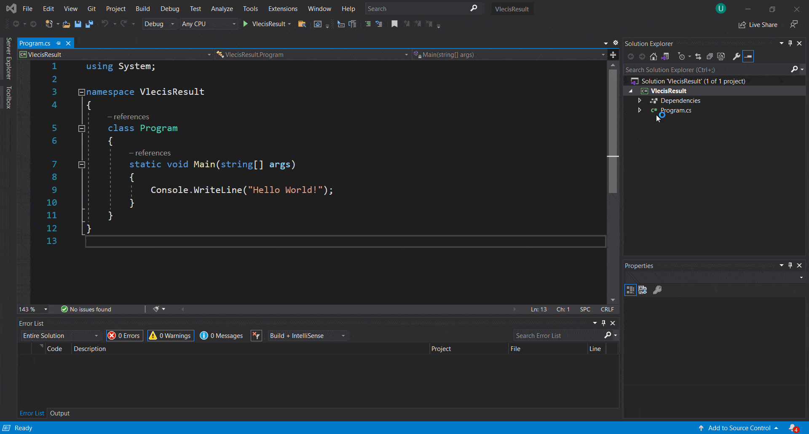

<br>
<p align="center">
  &nbsp;&nbsp;&nbsp;&nbsp;&nbsp;&nbsp;&nbsp;<a href="https://lncodes.com">
    </img>
  </a>
</p>

<h1 align="center">VLECIS</h1>

<p align="center">
  <a href="https://github.com/lncodes/vlecis/actions/workflows/build.yml">
    
  </a> 
  <a href="https://github.com/lncodes/vlecis/actions/workflows/test.yml">
    
  </a>
  <a href="https://sonarcloud.io/dashboard?id=lncodes_vlecis">
    
  </a>
</p>

<p align="center">
  <a href="#introduction">Introduction</a> •
  <a href="#setup">Setup</a> •
  <a href="#contribute">Contribute</a> •
  <a href="#discuss">Discuss</a> •
  <a href="#support">Support</a> •
  <a href="#license">License</a>
</p>

---

<h2 id="introduction">✨ Introduction</h2>

This current repo contains the source code of the **VLECIS** package. This package used to Export/Import data into/from the CSV file. For more information about this project, you can refer to [Documentation](https://lncodes.com/studio/package/csharp-export-import-csv/).

<h3 id="objective">🎯 Objective</h3>

Here some objective we want to achieve from the **VLECIS** package :
1. Have a fast process time.
2. Easy to use, especially for a new programmer.
3. Have many configuration options for the users.
4. Support as many as possible data types that can be import and export to/from the CSV file.

<h2 id="setup">🧰 Setup </h2>

### ⚙️ Installation 
Follow these steps to install **VLECIS**
1. Clone/Download the **VLECIS** package.
``` bash 
git clone https://github.com/lncodes/vlecis.git
```
2. Open and build the **VLECIS** package project.



3. Add package dependency to your project.


### 💻 Usage
Follow these steps to use the **VLECIS** package.
1. Import vlecis package and fathgen module namespace to your class.
``` c#
using Lncodes.Pacakge.Vlecis;
using Lncodes.Module.Fathgen;

namespace Lncodes.Vlecis.Result
{
    public class Program
    {
    }
}

```
2. Make vlecis class instance with class that you want to import.
``` c#
using Lncodes.Pacakge.Vlecis;
using Lncodes.Module.Fathgen;

namespace Lncodes.Vlecis.Result
{
    public class Program
    {
        private static void main(string[] args) 
        {
            var filePathGenerator = new FilePathGenerator<CsvFileExtension>("FileName", CsvFileExtension.CSV);
            var config = new VlecisConfig(filePathGenerator);
            var vlecis = new Vlecis<MockData>(config);
        }
    }
}
```
3. Call export/import method.
``` c#
using Lncodes.Pacakge.Vlecis;
using Lncodes.Module.Fathgen;

namespace Lncodes.Vlecis.Result
{
    public class Program
    {
        private static void main(string[] args) 
        {
            var filePathGenerator = new FilePathGenerator<CsvFileExtension>("FileName", CsvFileExtension.CSV);
            var config = new VlecisConfig();
            var vlecis = new Vlecis<MockData>(config);

            var mockData = new MockData();
            vlecis.ExportFrom(mockDataWithValue);
            vlecis.ImportTo(mockData);
        }
    }
}
```

> For more information about how to use vlecis package, you can visit the [Documentation](https://lncodes.com/studio/package/csharp-export-import-csv/) page.

<h2 id="contribute">💖 Contribute</h2>

Want to contribute to this project? Please read our project [Contribution Guidelines](CONTRIBUTING.md).

<h2 id="discuss">💬 Discuss</h2>

If you have any questions about this project, you can go to [Discussion Forum](https://github.com/lncodes/vlecis/discussions) or directly comment on [Documentation](https://lncodes.com/studio/package/csharp-export-import-csv/) page.

<h2 id="support">💌 Support</h2>

Please support us to make other helpful content.

<a href="https://www.buymeacoffee.com/lncodes" target="_blank"></a>

<h2 id="license"> 📋 License</h2>

This project is open-sourced software licensed under [MIT](https://github.com/lncodes/vlecis/blob/master/LICENSE) license.